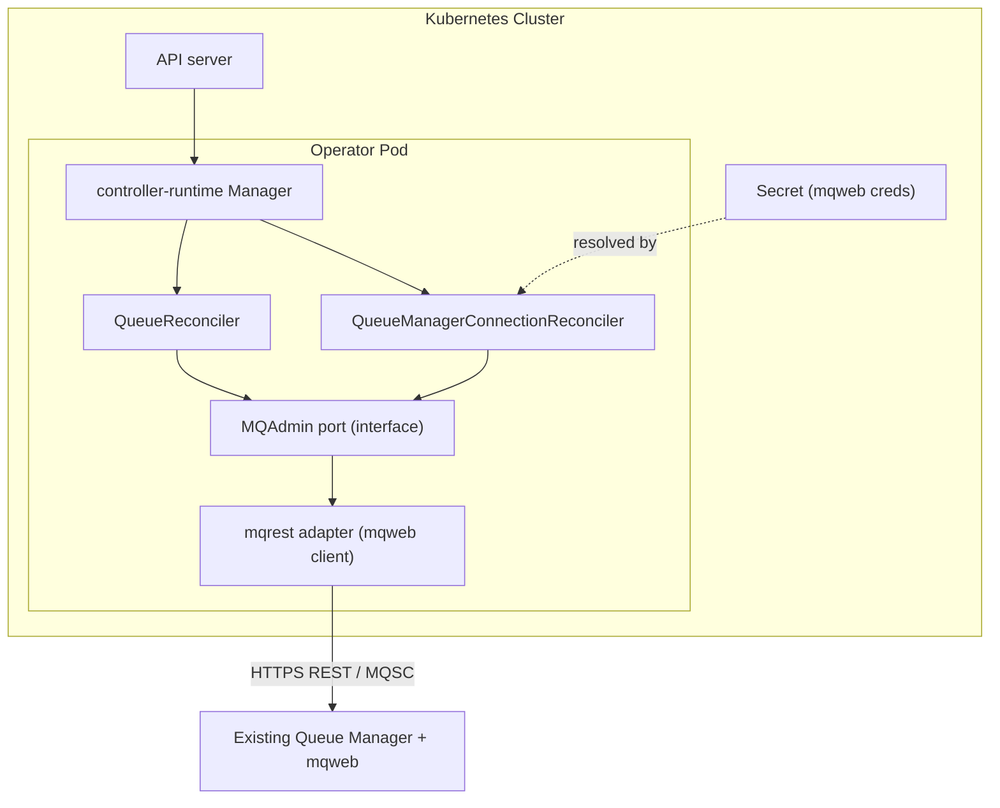
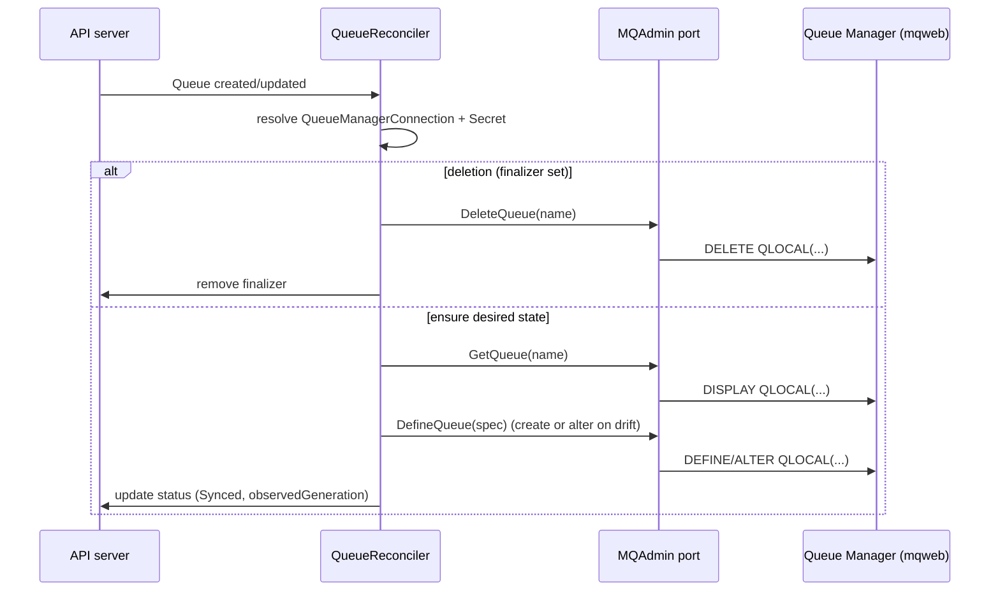
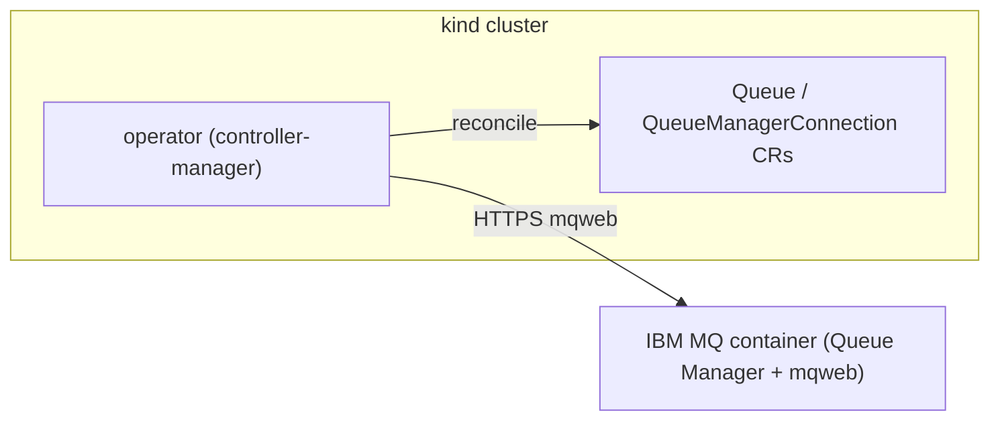

# Architecture

This document describes the design of the IBM Message Queue Operator: its
components, the custom resources it manages, the reconcile flow, and the local
development topology. For conventions and tooling see
[../AGENTS.md](../AGENTS.md); for the delivery plan see [ROADMAP.md](ROADMAP.md).

## Scope

The operator manages **administrative objects on an existing IBM MQ Queue
Manager** declaratively. It is explicitly **not** responsible for deploying or
operating Queue Manager installations. The Queue Manager already exists and
exposes the IBM MQ Administrative REST API (`mqweb`).

The initial `v1alpha1` API targets two resources:

- `QueueManagerConnection` — how to reach a Queue Manager (endpoint + creds).
- `Queue` — a queue to maintain on a referenced Queue Manager.

## Components



| Component | Responsibility |
|-----------|----------------|
| **Manager** (`cmd/`) | Wires reconcilers, caches, health/metrics, leader election. |
| **Reconcilers** (`internal/controller`) | Thin control loops. Translate desired vs. observed state and call the `MQAdmin` port. No HTTP/MQ details. |
| **MQAdmin port** (`internal/mqadmin`) | Go interface describing MQ operations (define/inspect/delete queue, ping connection, etc.) plus domain types. The seam that makes controllers testable and backends swappable. |
| **mqrest adapter** (`internal/adapter/mqrest`) | The only `MQAdmin` implementation today. Talks to `mqweb` over HTTPS, posting MQSC commands and parsing responses. |
| **Secret** | Holds mqweb credentials (and optionally TLS material), referenced by `QueueManagerConnection`. Never inlined in specs. |

### The MQAdmin port

A representative shape (final signatures land in Phase 2):

```go
// MQAdmin is the seam between reconcilers and IBM MQ.
type MQAdmin interface {
    Ping(ctx context.Context) error
    GetQueue(ctx context.Context, name string) (*QueueState, error)
    DefineQueue(ctx context.Context, spec QueueSpec) error
    DeleteQueue(ctx context.Context, name string) error
}
```

- Reconcilers depend only on this interface.
- `mockery` generates a mock from it for unit tests (`test/mocks`).
- A future PCF backend can implement the same interface with no controller
  changes.

## Custom resources

### QueueManagerConnection

Describes how to reach a Queue Manager. Cluster- or namespace-scoped (TBD in
Phase 2; namespaced by default for multi-tenant isolation).

```yaml
apiVersion: messaging.heimel.dev/v1alpha1
kind: QueueManagerConnection
metadata:
  name: qm1
spec:
  queueManager: QM1            # MQ Queue Manager name
  endpoint: https://mq.example.com:9443
  tls:
    insecureSkipVerify: false
    caSecretRef:               # optional CA bundle
      name: qm1-ca
  credentialsSecretRef:        # username/password for mqweb
    name: qm1-mqweb
status:
  conditions:                  # Ready=True once Ping succeeds
    - type: Ready
      status: "True"
```

### Queue

A queue maintained on a referenced Queue Manager.

```yaml
apiVersion: messaging.heimel.dev/v1alpha1
kind: Queue
metadata:
  name: orders
spec:
  connectionRef:
    name: qm1                  # references a QueueManagerConnection
  queueName: APP.ORDERS        # MQ object name
  type: local                  # local | alias | remote (start with local)
  attributes:                  # MQSC attributes, e.g. MAXDEPTH
    maxDepth: 5000
    description: "Orders intake queue"
status:
  conditions:                  # Synced=True when MQSC matches spec
    - type: Synced
      status: "True"
  observedGeneration: 3
```

Design choices:

- `connectionRef` decouples queue definitions from connection details and lets
  many queues share one connection.
- `attributes` map to MQSC attributes so new attributes can be supported
  without API churn; a curated, validated subset is promoted to typed fields
  over time.

## Reconcile flow



Principles:

- **Idempotent**: define/alter MQSC so repeated reconciles converge; safe to
  re-run.
- **Drift detection**: compare observed MQSC attributes against spec each loop
  and correct.
- **Finalizers**: a finalizer guarantees the MQ object is removed before the CR
  disappears.
- **Status conditions**: `Ready` (connection reachable) and `Synced` (object
  matches spec), plus `observedGeneration`, give clear, machine-readable state.

## Why REST over PCF

| Aspect | mqweb REST (chosen) | PCF via `ibm-messaging/mq-golang` |
|--------|--------------------|-----------------------------------|
| Build | Pure Go, `CGO_ENABLED=0` | Requires MQ C client libs + CGO |
| Image | Slim, static binary | Must bundle native MQ client |
| Testability | Easy: `httptest` + mockable port | Harder: native client, command queues |
| Transport | HTTPS, firewall-friendly | MQ channels |

REST keeps the binary pure Go and the project easy to test and ship. The
`MQAdmin` port preserves the option to add a PCF adapter later if a deployment
requires it, without disturbing controllers.

## Local development topology



- **kind** hosts both day-to-day dev and e2e runs.
- A containerized Queue Manager exposing `mqweb` stands in for a real MQ; e2e
  asserts that applying CRs produces the expected MQSC objects.
- Unit/envtest layers need no MQ at all (port is mocked), keeping the inner
  loop fast.
